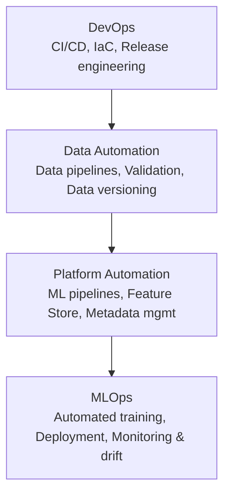
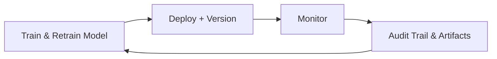
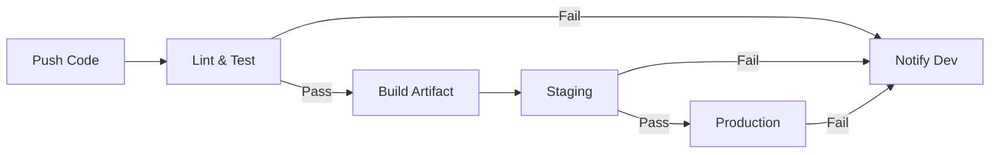

# MLOps

## Overview
MLOps is the practice of applying DevOps principles to machine learning workflows, ensuring reproducibility, automation, monitoring, and continuous improvement of ML systems in production. It bridges the gap between data science experimentation and reliable, scalable production deployment.

## ML Engineering Hierarchy of Needs

The *ML Engineering Hierarchy of Needs* defines the foundational layers required to operationalize machine learning. Each upper layer depends on the stability of the layers below it.



### Layers Explained

#### **1. DevOps (Foundation)**
The essential building block for ML systems:
- CI/CD pipelines for code and model delivery
- Infrastructure as Code (IaC)
- Release engineering and automated testing
- Containerization and orchestration

#### **2. Data Automation**
Reliable and automated data processes:
- Data ingestion & ETL pipelines
- Data validation and schema enforcement
- Data versioning and lineage tracking
- Automated drift detection

#### **3. Platform Automation**
Builds scalable, consistent ML infrastructure:
- Feature stores for online/offline features
- Centralized artifact & metadata management
- Standardized training and serving environments
- Reusable ML pipeline components

#### **4. MLOps (ML Automation)**
True machine learning operationalization:
- Automated train and retrain pipelines
- Model evaluation and comparison
- Deployment automation with versioning
- Monitoring and continuous improvement

## MLOps Feedback Loop

A core concept showing how models continuously improve after deployment.



### Feedback Loop Stages

#### **1. Train & Retrain Models**
- Reusable training pipelines
- Hyperparameter tuning
- Versioning of datasets, code, and models

#### **2. Deploy + Version**
- Automated deployments to staging and production
- Canary or blue/green deployment strategies
- Model registry integration

#### **3. Monitor**
- Detect data drift and concept drift
- Track latency, throughput, error rates
- Alert on prediction anomalies

#### **4. Audit Trail & Artifacts**
- Full lineage tracking (data → code → model → environment)
- Compliance and governance records
- Insights for debugging and retraining decisions

## CI/CD Pipeline for ML

CI/CD is foundational for continuous delivery of both software and machine learning artifacts.



## Key Components of an MLOps System

### **1. Data Pipeline**
- Data ingestion
- Validation (schema checks, drift checks)
- Transformation and feature preprocessing

### **2. Feature Store**
- Centralized storage for features
- Ensures training-serving consistency

### **3. Model Registry**
- Stores model metadata, versions, and artifacts
- Enables rollbacks and A/B testing

### **4. Experiment Tracking**
- Log hyperparameters, metrics, datasets, and code versions
- Compare experiments reproducibly

### **5. Model Monitoring**
- Drift detection (data, model, concept)
- Performance and reliability monitoring
- Alerts and retraining triggers

### **6. Orchestration**
- Workflow automation (Airflow, Prefect, KubeFlow)
- Dependency management and scheduling

## Folder Structure

```
.
├── data/
├── notebooks/
├── src/
│   ├── data/
│   ├── features/
│   ├── models/
│   └── serving/
├── tests/
├── configs/
├── scripts/
├── models/
├── Makefile
├── requirements.txt
└── README.md
```

## Quick Start

Install dependencies:
```bash
make install
```

Run tests:
```bash
make test
```

Run linting:
```bash
make lint
```

## References

- Designing Machine Learning Systems - Chip Huyen
- Practical MLOps
