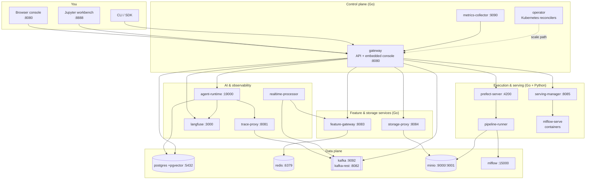

# Architecture

Nexus is a set of small, single-purpose services on one Compose network. A Go
**control plane** owns state and orchestration; Python **workloads** do the ML and
agent execution; a shared **data plane** (Postgres, Redis, Kafka, MinIO) holds
durable state and carries events.

## Component diagram

## The two DNS worlds

This is the single most important operational fact:

- **Inside the stack**, services reach each other by their Compose service name:
  `http://gateway:8080`, `http://mlflow:5000`, `http://minio:9000`, …
- **From your machine**, the same services are on published `localhost` ports.

When you register a connection in the console (so the gateway health-checks it), use
**in-stack hostnames** — the check runs from inside the gateway container. When you
point an external tool at a service, use **localhost**. See
[Connecting all services](../connecting-services.md).

## The three planes

### Control plane (Go)

The **gateway** is the heart of the system. It exposes the full REST API and serves
the embedded web console. Every resource mutation (create project, submit pipeline,
register model, deploy agent…) writes its resource, an immutable **audit** record,
and **Kafka outbox** entries in a single transaction. State persists to PostgreSQL
when `DATABASE_URL` is set; otherwise a local JSON file is used.

The gateway is also a **proxy and orchestrator**: it drives Prefect for pipelines,
the serving manager for model endpoints, the agent runtime for agent turns, the
storage proxy for object browsing, the feature gateway for lookups, and Langfuse for
prompts. It fails closed — if a downstream engine rejects a request, the control
plane reflects that honestly (e.g. a run is marked failed).

Supporting Go services: the **operator** (Kubernetes reconcilers for the scale
path), the **metrics-collector** (Prometheus exposition of platform metrics), the
**feature-gateway**, the **storage-proxy**, the **trace-proxy**, and the
**serving-manager**.

### Data plane

| Store | Role |
| --- | --- |
| **PostgreSQL** (with pgvector) | Control-plane state, the Kafka outbox, MLflow backend, Langfuse backend, agent checkpoints, and vector memory |
| **Redis** | The online feature store (low-latency lookups) |
| **Kafka** (+ REST proxy) | Durable lifecycle/audit events, LLM traces, and real-time demo topics |
| **MinIO** | S3-compatible object storage: models, artifacts, feature snapshots, traces, agent state, pipeline logs |
| **MLflow** | Experiment tracking and the model registry (Postgres-backed, MinIO artifacts) |

### Execution, serving, and AI (Python + Go)

- **Prefect** runs pipelines; the **pipeline-runner** serves platform flows as
  Prefect deployments and executes real training runs, logging to MLflow.
- The **serving-manager** launches an `mlflow models serve` container per deployed
  model version over the Docker API and records the live endpoint URL.
- The **agent-runtime** serves LangGraph agents over HTTP, with Postgres
  checkpoints, feature/memory retrieval, and Langfuse tracing.
- The **trace-proxy** is the LLM egress: agent calls go through it, it forwards to
  the configured provider, and it publishes every call to a Kafka traces topic.
- The **realtime-processor** consumes Kafka topics, enriches events with online
  features, scores them with a model or agent, and publishes results.

## Request lifecycle examples

=== "Submit a pipeline"

    1. Console → `POST /api/v1/pipelines/submit` on the gateway.
    2. Gateway persists a `queued` run (+ audit + outbox) and creates a **Prefect
       flow run** carrying the run id and project id.
    3. The **pipeline-runner** executes the flow; each step reports back via
       `POST /api/v1/pipelines/runs/{id}/steps`.
    4. The gateway recomputes run status/progress deterministically; the console's
       DAG updates live over SSE.
    5. The training step logs the model to **MLflow** and registers it with the
       control plane.

=== "Deploy and predict a model"

    1. Console → `POST /api/v1/models/{id}/deploy`.
    2. Gateway calls the **serving-manager**, which starts an `mlflow models serve`
       container and returns the live endpoint URL.
    3. Gateway records the endpoint and marks the model `serving`.
    4. Console → `POST /api/v1/models/{id}/predict` → gateway proxies to the
       endpoint's `/invocations` → live prediction returns.

=== "Ask an agent"

    1. Console → `POST /api/v1/agents/{id}/invoke`.
    2. Gateway proxies to the **agent-runtime** with the agent's identity headers.
    3. The runtime runs the LangGraph graph: it loads the Postgres checkpoint,
       retrieves features/memory, and calls the LLM **through the trace-proxy**.
    4. The trace-proxy forwards to the provider and publishes the call to Kafka;
       the runtime reports the session (turns, tokens, cost) back to the gateway.
    5. The reply returns; the console's Session Monitor and cost dashboard update.

## Live updates

The console avoids polling storms: the gateway exposes `GET /api/v1/events` as
Server-Sent Events carrying a cheap **state digest**. When the digest changes, the
active panel re-fetches its own data. This keeps the DAG, sessions, and real-time
cards live without hammering the API.

## Deployment topology

- **Local:** `deploy/compose.yaml` — all services, ports published to localhost,
  auth optional (RBAC role from `MLAIOPS_LOCAL_ROLE`, default `admin`).
- **Public:** `deploy/compose.yaml` **+** `deploy/compose.public.yaml` — the same
  services, but internal ports are closed and a **Caddy** TLS edge + **Dex** OIDC
  provider are added in front. Auth is on; RBAC roles come from OIDC claims.
- **Scale path:** the literal Kubernetes stack (Kind cluster, CRDs, operator,
  KServe/KFP/Istio) under `config/` and `deploy/kind/` — optional, documented, and
  not required for local or single-VM use.
